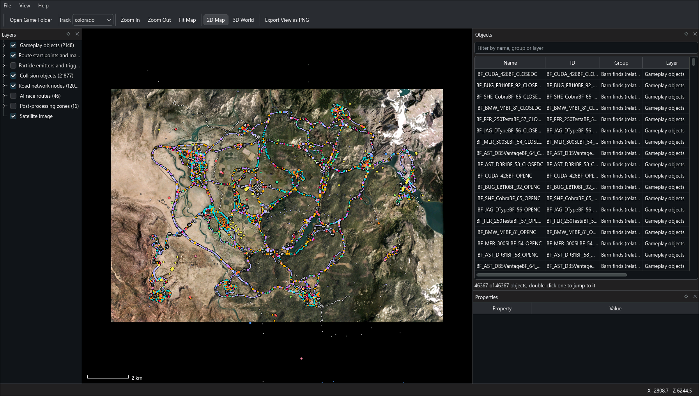

# FH1 Map Viewer

A Qt 6 / C++20 desktop viewer for the world of Forza Horizon (Xbox 360), read straight from an extracted disc.

The repository contains no game data: the viewer reads the files of your own copy of the game.



It shows the game's own satellite map (`UI.zip` → `New Map/MapGameReady.jpg`) with these layers over it:

| Layer                                                                       | Source                                   | Colorado count |
|-----------------------------------------------------------------------------|------------------------------------------|----------------|
| Gameplay objects (barn finds, speed cameras, festival sites, gas stations…) | `Ribbon_00/GameObjs.xml`                 | 2,148          |
| Route start points and markers (start grids, waypoints, checkpoints…)       | `Ribbon_00/TrackRouteNNN.xml`            | ~7,800         |
| Particle emitters and trigger zones                                         | `Ribbon_00/ParticleEmitters.xml`         | 2,367          |
| Collision objects (barriers, signs, benches…)                               | `Ribbon_00/CollObjs.xml`                 | 21,877         |
| Road network nodes                                                          | `<track>.nav`                            | 12,036         |
| AI race routes, named from `gamedb.slt`                                     | `aiopenworld.zip` → `route_NNN.owt`      | 46             |
| Post-processing zones                                                       | `Ribbon_00/PostProcessingZones_Safe.xml` | 16             |

Gameplay objects are drawn with the game's own map icons and named from the game's text:

- **Race events, exhibitions and nemesis races:** event names such as "Oakley Blitz".
- **Barn finds:** full car names such as "1971 Plymouth Cuda 426 HEMI".
- **Other activities:** speed traps, speed zones, flyers, gas stations and the festival buildings are grouped by their in-game category.
- **AI routes:** real names such as "Beaumont Circuit".
- **Post-processing zones:** labelled with their region names.

Labels can be toggled with View → Show Labels (Ctrl+L).

Each layer is split into groups that can be toggled separately in the Layers panel. Click an object to see its properties, or search for one in the Objects panel and double-click to jump to it. The status bar shows the world X/Z under the cursor, and right-clicking copies it.

**Events** (View → Events): the track's race events, with their name, type (festival circuit or point-to-point, street, showcase, nemesis…), route, laps, length, car class and prize, sortable and filterable. Select one to show its route on the map and in the 3D world: the AI racing line where the game ships one (46 of Colorado's routes), otherwise straight lines from the pole position through the checkpoints to the finish, with the start grid, checkpoints, waypoints and finish line marked. The map zooms to the route and the 3D camera moves behind the pole position. Hide Race takes the route off both views.

**Editing** (Edit → Edit on Map, Ctrl+R, or the button in the Events panel). The viewer edits three of the game's files: a race's route file, the track's gameplay objects (`GameObjs.xml`) and the race settings in `gamedb.slt`.

- **Route points:** with a race selected, drag its start grid slots, checkpoints, waypoints and finish on the 2D map to move them; hold Alt while dragging to turn them. Right-click a checkpoint or waypoint to add one after it; click one and press Delete to delete it. Later ones are numbered along, a checkpoint's indicators move, renumber and go with it, and the finish takes its cannons along.
- **Gameplay objects:** drag a marker (a race start, speed camera, gas station, barn find…) to move it, Alt-drag to turn it. Objects that belong together move and turn together: a race start and its sign-up nodes (`FR04`, `FR04_NODE`, `FR04_00`…), a speed camera's left and right, a barn find's open and closed states. Shift-drag moves one object alone. Selecting an object rings the objects related to it, even hidden ones, and lists them in Properties (double-click one to go to it); right-click → Show Related Objects zooms to the group. Delete deletes the selected object, Shift+Delete it and its group; when one of the game's activities uses an object, the viewer asks first.
- **Heights:** a moved point or object takes the height of the ground under it from the 3D world when that is loaded, otherwise of the nearest road node within 40 m, otherwise keeps its own.
- **Race settings** (Edit → Race Settings…, or the button in the Events panel): laps, opponents, prize, car class and start time.
- **Deleting a race event** (select it in the Events panel and press Delete, or Edit → Delete Race Event…, or right-click it): a dialog lists what can go, all ticked: its gameplay objects in `GameObjs.xml`, and its rows in `gamedb.slt` with every row that refers to it (race, AI drivers, recommended cars, restrictions, colours, music, prizes, unlocks). Its props in `bin.zip`, its activity in `gamemodes.zip`, its effects in `ParticleEmitters.xml` and its route file stay.
- **History:** Edit → Undo and Redo, and the Edit History panel (View → Edit History), which lists every edit under the file it changes, marks undone ones and where each file was saved; double-click an edit to go back or forward to it. The Events panel marks races with unsaved edits with `*`.
- **Right-click menus:** the map, the Objects, Events and Layers panels, Properties and the World Debug lists each have one; actions with nothing to act on are greyed out.

File → Save Edits (Ctrl+S) writes every edited file where you choose on the first save (or with File → Where to Save Edits…): **Game Folder** replaces the game's own files, and the viewer's next start shows the edits; the first save of each copies the original to `backups/` in the viewer's data folder (`~/.local/share/fh1-tools/fh1-map-viewer` on Linux), so the game folder holds only the files the game expects; **Another Folder…** writes them at the same path the disc uses, under that folder's `media` folder when it has one (a copy of the disc) or under the folder itself (a copy of `media`). The viewer never reads from another folder. Saving keeps everything that was not edited byte for byte, and writes edited parts the way the game's files do. The AI racing line and the race's props (start gantry, barriers) stay where the game puts them.

**3D world** (View → 3D World, Ctrl+2): fly through the track's terrain, roads, towns, festival sites and distant mountains, decoded from the game's render models in `bin.zip`, with the props (buildings, signs, poles, tents, parked cars…) and the trees, bushes and fences placed where the game puts them.
- **Textures:** everything is drawn with the game's own textures, streamed in after the geometry. The ground blends its two or three layers (grass, dirt, rock, sand) through its splat map or vertex colour and darkens them with its ambient occlusion map, as the game's terrain shaders do. Lakes and rivers are drawn as translucent water that ripples with the game's normal maps and reflects the sky colour; the game reflects a cube map of the scene instead, which the viewer does not have. Textures that exist only as small copies in the `.bundle` packs (mostly flat colours) are drawn from those copies.
- **Map layers in 3D:** the layers shown on the 2D map are drawn in the world at their real positions and heights: objects as the game's icons or coloured markers (with a tick for their heading up close), AI routes as lines, and zones as translucent areas, with labels nearby. Hills hide what is behind them. The Layers panel's checkboxes apply to both views.
- **Selection:** click a marker, route or zone to select it; the Objects and Properties panels follow, and the selection stays highlighted in both views. Double-clicking an object in the Objects panel flies the camera to it.
- **Model selection:** click a building, tree, rock or the ground itself to select that model; it is outlined, Properties shows its file, part name, kind (world geometry, zone-placed prop or procedural copy), level of detail, draw distances, position, size and triangles, and the World Debug panel shows it on its own. Map markers take priority when both are under the cursor; Esc clears the selection.
- **Controls:** click to select, drag to look, W A S D to move, Q and E to go down and up, Shift to go faster, and the mouse wheel to change speed.
- **Loading:** the world streams in 500 m tiles at a level of detail chosen by distance. The first opening of a track indexes its models (a few seconds); the index is cached after that.
- **World Debug** (View → World Debug, Ctrl+Shift+D): lists the model files in the loaded tiles (LOD, tile, triangles, textures, read errors) and the textures they use (size, format, source file, video memory, status). Select a texture to preview it at any mip level, as colour, alpha or both, and save it as a PNG. Select a model to see it on its own, textured as in the world, and to list its textures: drag to turn it and scroll to zoom (or use the arrow keys, + and −; Home or a double-click resets the view). Select a texture to list the models that use it.
- **Clear Cache** (File menu): deletes the cached world indexes (`world/*.index` in the user cache folder). The 3D world shown at the time is rebuilt straight away.
- **Props:** about 48,000 placements of some 2,300 prop models on Colorado, each drawn at the level of detail and up to the distance the game's own data gives. A few hundred prop models have no placement and are not drawn.
- **Trees, bushes, rocks and fences:** about 128,600 copies from the game's procedural sets (white fir, blue spruce, cottonwood, pinion, creosote, sagebrush and more), drawn up to the game's own distance, usually 220 m for trees. Beyond that the game shows flat billboard trees, which the viewer does not draw, so distant forests are the terrain's own texture. Grass is not drawn. Race and festival gear (barriers, chevrons, banners, grandstands, flags) is something the game only puts out for events. "Event props in 3D" in the Events panel (also View → Event Props) chooses how much of it to draw:
  - **None:** the world as it is outside events.
  - **Selected race** (the default): only the gear of the race selected in the Events panel (its start gantry, barriers, chevrons, banners and stalls), and none while no race is selected. Gear shared by the races run on the same route shows for each of them. Street races have little: Plains Run has 5 props.
  - **All events:** every event's gear at once.

## Build

Requires CMake ≥ 3.21, a C++20 compiler, Qt ≥ 6.5 (Core, Gui, Widgets, Sql with the SQLite driver, Concurrent, OpenGL, OpenGLWidgets, Test), zlib, and a GPU with desktop OpenGL 3.3 for the 3D view.

```sh
cmake -S . -B build -G Ninja -DCMAKE_BUILD_TYPE=RelWithDebInfo
cmake --build build
ctest --test-dir build
```

To also run the checks against a real disc:

```sh
FH1_GAME_DIR=/path/to/extracted/disc ctest --test-dir build
```

## Run

```sh
./build/fh1mapviewer /path/to/extracted/disc      # or pick it with File → Open Game Folder
```

The folder can be the disc root (holding `default.xex` and `media`) or the `media` folder itself. The last folder, track, layer visibility and window layout are remembered.

For scripted use (no display needed with `QT_QPA_PLATFORM=offscreen`, except for the 3D view):

```sh
fh1mapviewer DISC --layers gameobjs,nav --centre -1239,1435 --zoom 2 --screenshot out.png
fh1mapviewer DISC --select BF_CUDA_426BF_CLOSEDC --screenshot car.png
fh1mapviewer DISC --race FR04 --view 3d --screenshot race.png   # a race's route, from behind its pole position
```

`fh1render` renders a 3D view to a PNG without a window, with the same renderer (it needs OpenGL 3.3 but no display):

```sh
fh1render DISC out.png --camera 1600,400,-2400,60,-12   # x,y,z, heading (0 = east, 90 = north), pitch
fh1render DISC out.png --untextured                      # plain ground colours, no textures
fh1render DISC out.png --event-props                     # also draw race and festival gear
fh1render DISC out.png --layers gameobjs,airoutes        # with map layers and their labels
```

`fh1meshscan` parses every render model in an archive and reports LOD statistics:

```sh
fh1meshscan media/tracks/colorado/bin.zip
```

`fh1zip` lists, extracts and CRC-verifies entries of the game's zip archives:

```sh
fh1zip list media/UI.zip "New Map"
fh1zip extract media/UI.zip "New Map/MapGameReady.jpg" map.jpg
fh1zip verify media/tracks/colorado/bin.zip
```

## Format notes

These were worked out while building the viewer and are verified against the disc.

**XMemCompress LZX (zip method 21).** Each entry is a series of chunks: `FF, u16be outSize, u16be inSize` or just `u16be inSize` for a 32 KiB chunk. Each chunk decodes to one LZX frame. Decoder state carries across chunks, but the bit reader restarts at every chunk. Two details differ from cabinet LZX (and from libmspack):

- An odd-length uncompressed block is **not** followed by a pad byte. The next block header starts on the very next byte.
- 16-bit word alignment is measured from where bit reading resumed: the chunk start, or the byte after an uncompressed block's data. It is not measured from the stream start.

With these rules, all 230,057 entries of `tracks/colorado/bin.zip` and every other archive on the disc decode and match their CRC-32.

**Zip layout.** The data offset of each entry is in extra field `0x1123`. Many archives have no local headers. The 16-bit entry count in the end record wraps for `bin.zip`, so the central directory is walked by size.

**`<track>.nav`** (big-endian): a 10-word header (word 1 = node count, word 4 = total links), then 32-byte nodes `{u32 id, f32 x, y, z, u32 linkCount, u32 firstLink, u32 ?, u32 ?}`. The link table that follows is not decoded yet.

**`route_NNN.owt`** (big-endian): `"OWTM"`, `u32 version = 1`, 8 zero bytes, `u32 pointCount`, `u32 isLoop`, 8 zero bytes. Then 48-byte points starting with `f32 x, y, z`, then a 16-byte trailer. `NNN` is `Tracks.RouteId` in `gamedb.slt`.

**Race events.** A race event is an `Events` row joined with its `Races` row (one per event on Colorado) and the `Tracks` row that `Races.TrackId` names; `Tracks.Length` is in metres, `Events.CareerTypeId` names a `CareerEventTypes` row and `Events.TargetClass` a `CarClasses` row. `CareerEventStyle` 0 marks the free-roam session, which is not a race. The race's transforms are in `Ribbon_00/TrackRouteNNN.xml`, where NNN is `Tracks.RouteId`, not the track id (track 1001 uses route 12, track 322 route 2): `<NamedTransform name>` elements, the finish trigger with a `width` in metres, each holding a `<Transform>` with `pos.*` and `facing.*` attributes. The names give each transform's role: `start_location_NN` (grid slots, pole first), `route_waypoint_NN`, `route_checkpoint_NN` (street races), `route_checkpoint_indicator_NN[b]`, `route_boundary_NN`, `end_race_cannon_trigger` (the finish), `end_race_cannon_left/right_NN`, `start_gantry_cannon_NN`, `post_race_location_NN`, and photo and stunt mission points.

**Writing route files.** The game's route files use CRLF line ends, tab indents and single-quoted attributes, and write numbers like C's `%.6g` with a three-digit exponent and `.0` after whole numbers (`-1276.13`, `0.0`, `-2.8213e-007`); that rule reproduces all 48,114 values of Colorado's 243 route files. `TrackRoute001.xml` is laid out by hand (double quotes, one attribute group per line); its unedited transforms stay that way. Checkpoints carry a gate `width`, and some transforms a `tag` attribute (`tag='e'`), which saving keeps. Each checkpoint has an indicator a few metres off (`route_checkpoint_indicator_NN`), sometimes with a second one (`…_NNb`).

**Writing gameplay objects.** `GameObjs.xml` numbers its objects `Obj0`, `Obj1`… in order (Colorado has 2,148), each with a `GameplayID`, a `<Pos>` and an `<Orientation>` of X, Y and Z axes. Numbers are written with six decimals as C's `%.6f` does, rounding halfway values away from zero (`4148.789063`, where glibc gives `…062`) and keeping the sign of negative zero (`-0.000000`); with those rules all 25,776 numbers come out as the file has them. Objects that belong together share a name once a role suffix is dropped (`_NODE`, `_L`, `_right`, `_DISCOVERY`, `_OPEN`, `_CLOSEDC`…) or a number whose ID without it is itself an object (`FR04_07` → `FR04`, but `flyer_007` has no `flyer`); barn finds are named both `BF_<car>` and `BARNFIND_<car>`.

**Race settings and events in gamedb.** `Races.NumLaps`, and in `Events`: `NumberOfDrivers` (the AI cars: 7, 1 for rivals, 0 for the plane races), `CashPrize`, `TargetClass` (a `CarClasses.Id`) and `TimeOfDayStart` (seconds after midnight). Thirteen columns in twelve other tables refer to an event by its `Events.Id` (`Races`, `EventParticipants`, `EventRecommendedCars`, `EventRestrictions`, `EventShowroomChallenges`, `EventUIColors`, `Event_Music`, `EventHubInitialEvents`, `Rewards_EventPrizes`, `Rewards_EventUnlock` twice, and two empty `NewProfile_*` templates).

**Map image calibration.** `MapGameReady.jpg` is 5120×3072. Image pixel = (0.2675·X + 2559.0, −0.2673·Z + 1227.5), about 3.74 m per pixel. This was fitted by projecting the `.nav` road nodes onto the image and maximising their overlap with road pixels. Tracks without a known image use 1 px = 1 m.

**String tables** (`stringtables/<LANG>.zip` → `*.str`): `"LSB2"`, header words, then at 0x28 a `u32` count N. Then N entries `{u16 key, u32 offset}` sorted by key, a `0xFFFF` sentinel entry, and NUL-terminated UTF-16BE strings. Offsets count UTF-16 units from the start of the strings. A database text value such as `_&202713995` refers to key `value & 0xFFFF` in the table named after the database table (`Events.str`, `Tracks.str`, `Data_Car.str`, `List_CarMake.str`). The high bits identify the table.

**Map labels and icons.**

- **Activity locations.** An activity config in `gamemodes.zip/<Track>/*.xml` places its activity at the GameObjs IDs named by `<TriggerZone object=…>`. The trigger zone's `radius` is how close you must drive to be offered the activity. `<Behaviour id="CPlaceCarAtObject" object_name="…_NODE">` names where the game places your car when the activity starts, typically about 10 m from the trigger. Activities without trigger zones (speed traps, speed zones, flyers) are placed at objects whose IDs extend the activity's name, such as `speed_camera_30_left`.
- **Event names.** `Events.HorizonEventID` (e.g. `FR05`) links objects to career events.
- **Icon categories.** `ui/MapProfileFullscreen.xml` maps each map category (`mapTag`, e.g. `barnfind`) to cells of `ui/textures/Horizon.zip → Map/icons/MapIcons/<LANG>/MapIconSheet.xds`. The icon is the stack of its `icon_up` and `icon_up_career` symbolizers. The other symbolizer types are player-progress overlays such as the "NEW" badge and the finished trophy.

**Render models (`*.rmb.bin` in a track's `bin.zip`)**, big-endian. All 102,012 Colorado models parse with this layout:

- **Header:** `u32 6`, the bounding box (two float4s at 0x04 and 0x14), a 4×4 transform at 0x24 (identity in every file), and the part count at 0x74. Parts start at 0xB0.
- **Part:** a name, `u32 3`, the vertex count, the stride (16–36), `u32 0`, then the vertices, each starting with `f32 x, y, z`. Then `u32 1, materialCount, 1` and the materials. Between parts: a 48-byte bounds block and `u32 1`.
- **Material:** `u32 2`, a name, `0, ?, table index, 1`, 48 bytes (position offset, position scale, texture coordinate offset u, v and scale u, v, each a float4), then `4, 0, indexCount, indexWidth (2|4)`, the indices, and `endTag, 1`.
- **Material table** (after the last part): `u32 1, 1, 1`, the entry count, and per entry `3, shader, 0`, two groups of `1, n, n × float4` shader constants, then `1, slotCount` and the texture slots (an index into the model's texture list, or `0xFFFFFFFE` for engine textures such as lightmaps). Then `1, shaderCount` and the shader paths (`shaders\track\h_diff_1.fx`), followed by compiled shader code.
- **Index buffers:** triangle strips with all-ones restart markers. A buffer without restarts whose length is a multiple of three is a triangle list; this rule is inferred from the data.
- **Coordinates:** positions have Z negated compared with the placement XMLs and the 2D map.
- **Duplicates:** most models are stored several times under the same name with identical contents; Colorado has 14,291 distinct models.
- **Local-space props:** models centred on the origin are props in local space, placed by the zone files (below). So are models whose draw records move them away from where their file puts them: 138 on Colorado, such as the dam's buildings, the gondolas, mining towers, barns and the festival's main stage, are modelled around a pivot far from their centre and would otherwise land near the world origin. A second copy of the dam bridge is placed at the origin itself, and the zone there lists it, so the viewer draws it there too.
- **Backdrop terrain:** `TERR_UberLOD_*` models are a low-detail terrain for the whole map. Where detailed terrain exists they lie within a few metres of it, sometimes up to 9 m above it; beyond the drivable area they are the only ground. Their level names start at `LOD00` like everything else (and `TERR_UberLOD_Patch18` has none), so distance bands alone would draw them close up. The viewer draws them behind all other geometry instead, so they only show where nothing else covers the ground. In places (the festival) they lie 14 m above the ground, and from below they would hang over the view like a ceiling; the viewer draws each piece from the zones whose lists name it, as the game does (see "Visibility zones" below). From other zones it draws a piece only below the camera's height, where it can only show through the hairline cracks between neighbouring ground pieces drawn at different levels of detail. Only the `LOD00` pieces are in any zone's list, so the `LOD01` and `LOD02` sets are left out and `LOD00` is drawn at every distance.
- **Scene copy:** `TERR_CUBE_*` models are a crude copy of the scene (ground, roads, and buildings as plain blocks), most likely what the game renders into its reflection cube maps; every surface exists in full detail elsewhere, so the viewer leaves them out. `Plane001` with `light_pollution.fx` is a 1 km glow plane over the town at night, an effect rather than a surface, and is skipped too, as are materials named `Placeholder*`: an abandoned set of terrain pieces, partly below the ground and textured "THIS OBJECT DOES NOT HAVE A FORZA MATERIAL". Models with the `CrowdTERR` material (`Plane004_LOD00` and 47 others) are flat polygons just above the ground, textured with an orange tile grid, that mark where spectators stand; the viewer skips them.
- **Level of detail:** comes from the `_LODnn` part of the name.
- **Vertices:** after the position come 4-byte inputs in the order of the shader's input table (normal, texture coordinates, tangent, colour). Texture coordinates are two unsigned 16-bit fractions, mapped through the material's offset and scale.

**Texture binding.** The track's `Ribbon_00/<Track>_00.pvs` (magic `FPVS`) lists the texture records (`u32 textureId, recordNumber, 1.0f, 1.0f, 0, 0, flags`), then shader paths, draw records, and one record per render model: `n`, n texture record numbers, `m`, m shader numbers, and 15 floats. Record *i* belongs to `<track>.<i>.rmb.bin`. A material's slot *k* is the texture for the shader's sampler register *k*; register 0 is the diffuse texture (`Diffuse_TextureSampler`, or `Blend_ASampler` for terrain) in every track shader. Each compiled shader (`shaders/track/*.fxobj`) has a vertex input table after its `vs_3_0` version string, which gives the offsets of the texture coordinate pairs and the vertex colour, and a pixel shader constant table in Direct3D's layout (big-endian, without the `CTAB` tag: a 28-byte header with version `0xFFFF0300` and target `ps_3_0`, then 20-byte records), whose register set 3 names each sampler register.

**Ground shading.** Terrain materials use `h_blnd2_*`/`h_blnd3_*` shaders (samplers `Blend_A`, `Blend_B`, `Blend_C`, `Splat_Sampler`, `AO_Sampler`) or `h_vblnd_*` (`Blend_A`, `Blend_B`, `AO_Sampler`). A splat texel's red channel weighs layer B, green layer C, and the rest layer A; vertex-blended ground mixes A and B by the vertex colour's alpha. The layers repeat over the first texture coordinate pair at the scales in the material's second group of shader constants (Blend_A and Blend_B in the first float4, Blend_C in the second); the splat and occlusion maps span the ground patch once, on the last coordinate pair the shader reads (the second for splat ground, the third for vertex-blended ground). The material's offset and scale decode every coordinate pair. Roads also name `Blend_A` and `Blend_B` but mix them with `Noise_Sampler` and `Modulate_Sampler`; the viewer draws their first layer. Water uses `lake_anim_norm_opac_refl_3` (`CubeMapSampler`, `NormalMapASampler`, `NormalMapBSampler`). All of this was read from the shaders' tables and the materials' data, not from the shader code.

**Prop placement.** The PVS file's draw records (18 bytes each, 62,173 on Colorado) each place one render object, named by the first `u16`; every level of detail of a prop is a draw record of its own. Where they go is in the zone files `__R00Z#####.pvsz` in `bin.zip`, which overlap and repeat each other: `u32 n` and n `u32` draw indices (low 16 bits), nine sections the viewer skips (each a `u32` count and fixed-size entries), then n transform records in the same order: three half floats (the level-of-detail switch distances and the far limit, in metres), the position as three `f32`, a 3×3 matrix as nine half floats in rows, 16 zero bytes, and a `u8` count of trailing blocks (`u32 a`, `u8 m`, m bytes, 32 bytes). A block with a = `0xFFFFFFFF` marks a prop the game only shows while an event or a script turns it on: race barriers, chevrons and banners, festival gear, the open and closed states of barn-find barns. Its 32 bytes are a NUL-padded name, which is set for 3,451 of Colorado's 22,263 event prop draws. For race and exhibition gear it is the event's `HorizonEventID` (`FR04`), or that ID with a suffix for a part of its set dressing (`FR04_01` to `FR04_14`, `FR04_NODE`, `FR04_ENDNODE`). Barn finds (`BF_CUDA_426BF_OPEN`), gas stations and outposts name themselves the same way. Street races name none. The m bytes are the race routes (`Tracks.RouteId`) the prop is put out for, one byte each (every race route on Colorado is below 256): `93 CE` is routes 147 and 206. Checked against the route files and racing lines, 95% of 28,730 such pairs put the prop within 100 m of its route (median 16 m), against 2.5% (median 3.9 km) with the routes shuffled. Named props mostly list route 0, the free-roam session's. Breakable props (road signs, cones, bins) carry blocks with other values of a, and most props carry none. A model vertex (x, y, z) as stored in its file goes to x·row0 + y·row1 + z·row2 + position; row 0 is the `XAxis` of the matching `CollObjs.xml` entry and row 2 its negated `ZAxis`. World-space models have an identity with Z mirrored. About 2,500 draws (mostly `LOD00`) are in no zone file; they sit next to another level of the same prop and share its transform. The layout reads every one of Colorado's 1,434 zones to its end and matches `CollObjs.xml` for 1,133 of 1,162 marker poles; it was worked out from the data, not from game code.

**Procedural sets.** Trees, bushes, rocks and many fences are copies placed by the `__R00G#####.pgeo` files in `bin.zip` (magic `OEGP`, big-endian), not by zone files. Sets named `Models_Ungrouped_*` hold models; others hold grass, crowds, light glows and night lighting in other layouts. At 0x40 a set has a count e of extra entries, at 0x48 its size, at 0x54 its mesh count m and at 0x60 its name. From 0x80 come m mesh entries of 64 bytes: bounds, a path length p, and three level-of-detail slots flagged 1 when used. Then one `u32` draw record per used slot of each mesh with p = 0, the p-byte source path of each other mesh, padding to 4 bytes, e entries of 8 bytes, and 20 bytes whose fourth `u32` is the group count g. Each of the g groups (92 bytes) gives a mesh, an instance count n at +48, a count b of 32-byte distance blocks at +56 and the draw distance at +60. From the next 16-byte boundary, each group's n instances follow (96 bytes: X, Y and Z axes, scaled; position with w = 1; a tint; the ground normal), then its b blocks, the first two values of a non-zero block being the level-of-detail switch distances (typically 50 m and 100 m). The draw records a mesh names are templates the game places at the world origin; the axes form a proper rotation, so the stored Z axis is negated to map a model's stored coordinates, where zone transforms already store it negated. Colorado has 1,562 model sets; the layout reads them all and was worked out from the data, not from game code.

**Visibility zones.** Each zone file lists the draws the game draws while the camera is in that zone. `Ribbon_00/<Track>_00.hex` says where the zones are: `"HEXY"`, `u32` 101, the cell radius (100 m) and the origin X and Z as `f32`, the zone count, and the number of columns (91) and rows (60), then one `u32` zone number per cell, row by row (`0xFFFFFFFF` for none), then 9 bytes per zone the viewer does not use. The cells are flat-topped hexagons: column c, row r is centred at X = originX + 100·(1 + 1.5c), Z = originZ + 173.2·(r + ½), with odd columns half a row further along Z. Zone n is `__R00Z<n>.pvsz`; each of Colorado's 1,434 zones has exactly one cell. The cell layout was matched against the props each zone lists (a prop drawn only within 300 m lies a median 232 m from the zones listing it, against 4.9 km with zones shuffled), not taken from game code. `PVSZLookup_00.dat` pairs a key with each zone number; the viewer does not need it.

**Track textures.** `_0x<ID>.bix` is a `BIX1` header (big-endian width, height, mip count, fetch-constant format word, total size, top-level size) followed by the smaller mips; `_0x<ID>_B.bix` holds the tiled top level. Small textures are whole in `_0x<ID>.bin`, a `CAFF` container whose `.data` section describes the texture (format word at 0x18, width and height at 0x24) and whose `.gpu` section holds the texels. The viewer uploads the top level's DXT blocks unchanged and builds smaller mips itself.

**Bundle packs (`_0x1000xxxx.bundle`).** Small copies (4×4 to 16×16) of nearly every texture, keyed by texture record number; for about a third of the textures the models use (all flagged `0x101` in the PVS file) they are the only copy. A pack is `u32 count`, then per texture `u32 record, width, height, mipCount, formatWord, 0xFFFFFFFF, size` and `size` bytes of tiled data. The same texture appears in several packs.

**Packed mip tail.** Tiled textures 16 texels or less on their shorter side keep their top level inside a shared 32×32-block tile, 16 texels along the shorter axis (along X for square textures). The bundle copies match the full-size textures only with this offset, and it applies to small CAFF strips such as 256×16 too.

**Xbox 360 textures (`.xds`).** A 52-byte header whose last 24 bytes are the GPU texture fetch constant: word 0 bit 31 = tiled; word 1 bits 0–5 = format, bits 6–7 = byte order; word 2 = (width − 1) | (height − 1) << 13. The top mip level follows, in the GPU's tiled block layout. DXT1/3/5 and 8_8_8_8 are decoded.

## Layout

- `src/core`: formats and loading (LZX, zip, XML/binary parsers, string tables, Xbox and track textures, activity configs, database, calibration). No widget code.
- `src/app`: the viewer (map view, layer items, 3D view with its world and map-layer renderers, World Debug panel with its model preview, main window).
- `tools`: `fh1zip` (archives), `fh1render` (headless 3D render), `fh1meshscan` (model statistics).
- `tests`: unit tests, with a small LZX encoder for building test streams, plus the optional real-disc suite.

## License

This library is licensed under the MIT License. See [LICENSE](LICENSE)

Forza and Forza Horizon are trademarks of Microsoft Corporation. Forza Horizon was developed by Playground Games and published by Microsoft Studios, and the game's data belongs to Microsoft. This project is not affiliated with or endorsed by Microsoft or Playground Games.
